# Data Export

TSE Analytics offers multiple options for data export depending on the data format and the user’s preferences.

## Export of Raw Data table

The data table of the active dataset including all variables can be exported using text (.csv) or Excel (.xlsx) format via **Export | Export to CSV** or **Export| Export to Excel** in the header.
After setting the file destination and file name in the File Explorer, the data table is stored at the selected destination by clicking **Save**. 

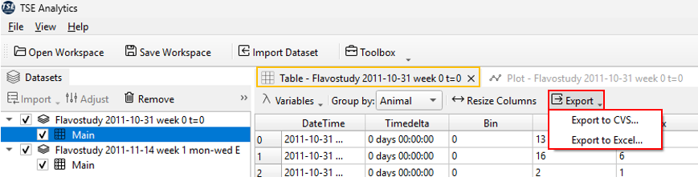

This data export option will save the current version of the active data table under consideration of changes that have been made using TSE Analytics. Changes considered for the exported data table include merging of datasets, exclusion of animals and animal selection in the animals list via checkboxes, exclusion of time phases and adjustment of time, editing of animal information or factors, time binning and removal of outliers.

!!! warning
    Variable selection and Split Mode selection in the Table control panel do not affect the content of the exported data table, but only the way data is displayed in the Table widget.
    The exported data table always contains all variables extracted from the PhenoMaster file and data for individual animals (as for Split Mode “By Animal”).

    Similarly, sorting of data entries in the Table widget will change the order of data entries displayed under Table, but will not affect the exported data table.

##  Export of Raw Data Plot

First, ensure that your **main window** is displaying the plot you wish to export. For instructions on how to display data plots, refer to the chapter of this manual **Import|Data Overview and Visualization**

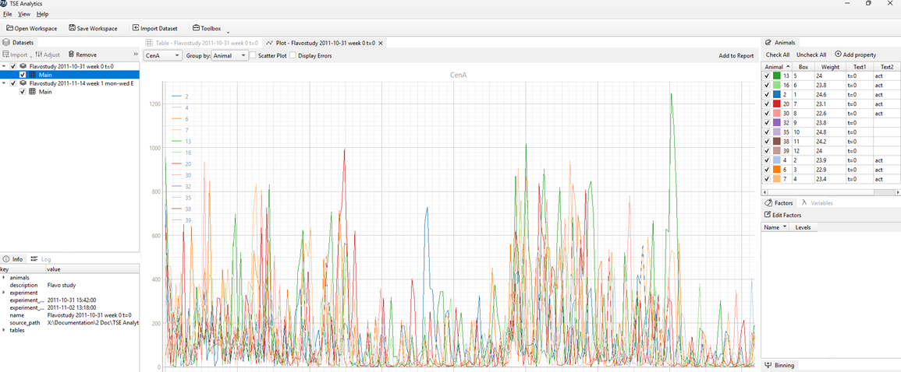

Once the plot is visible on your desktop, move the mouse cursor over the plot and **right-click**. This allows you to customize the display mode of the plot.

### Plot Export Options

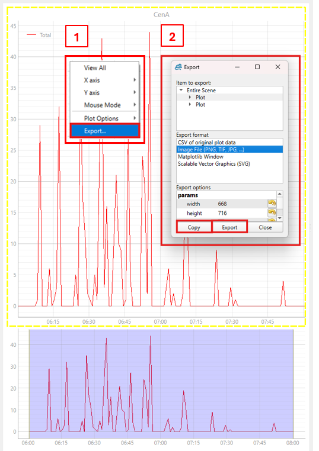

In the **Plot Export** menu, you will find several options for exporting or customizing your plots:  

- **CSV of Original Plot Data** – Exports the raw data used to generate the plot in CSV format.  
- **Image File** – Exports the plot as an image file (e.g., PNG or JPEG).  
- **Matplotlib Window** – Opens the plot in a separate **Matplotlib** window, allowing further customization and editing.  
- **SVG** – Exports the plot as a scalable vector graphic file.  

#### Matplotlib Window

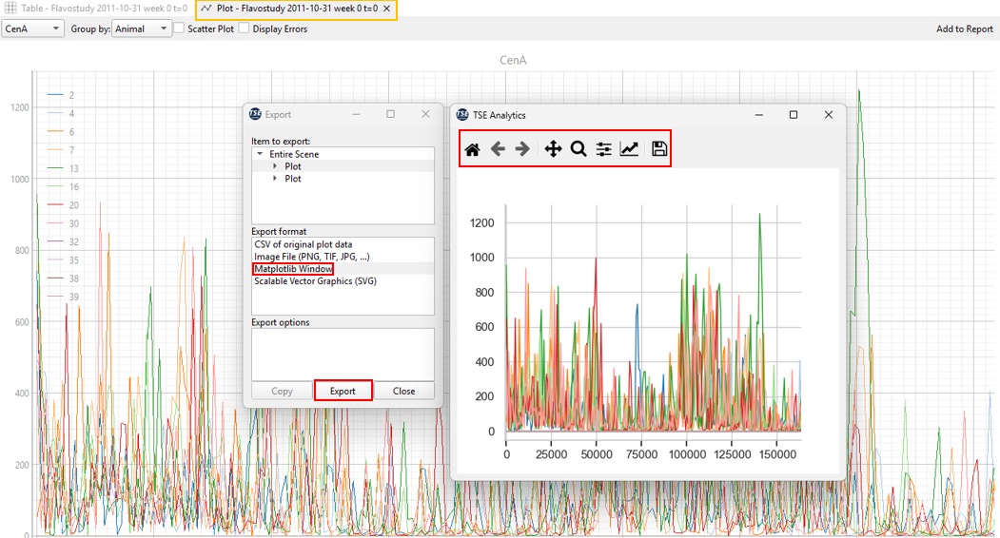

When selecting **Matplotlib**, the plot opens in a standalone Matplotlib interface where you can modify and refine its appearance in greater detail.  
The toolbar at the top of this window provides several useful tools, listed from left to right:  

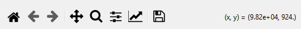

- **Home (House icon)** – *Reset View.* Restores the plot to its original appearance after any modifications.  
- **Back/Forward (Arrow icons)** – Navigate backward or forward through previous plot views or edits.  
- **Pan (Crossed arrows icon)** – Enables panning and zooming of the entire plot. Click and drag to move the plot or adjust the zoom level.  
- **Zoom (Magnifying glass icon)** – Allows zooming into a specific area of the plot. After selecting this tool, the cursor changes shape; click and drag to define the region to magnify.  
- **Configure Subplots (Three horizontal bars icon)** – Opens the subplot configuration panel, allowing you to adjust the overall layout, including figure size, margins, and spacing.  

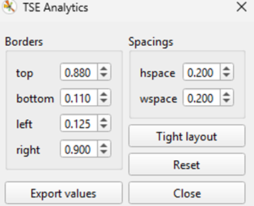

- **Edit Plot (Upward arrow icon)** – Opens the plot editor, where you can customize X- and Y-axis parameters such as range limits, scaling, and axis labels. 

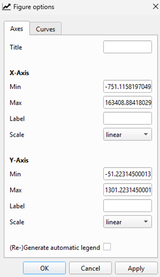

- **Save (Floppy disk icon)** – Opens the save dialog, allowing you to select an output format (e.g., JPG, PNG, PDF) and specify the file version or name.  

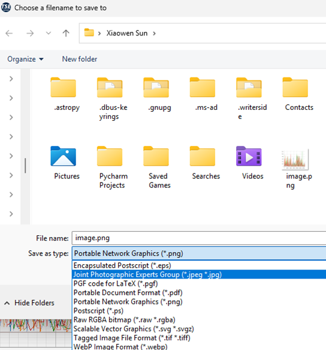

This option is particularly useful when you need to refine or customize the visual presentation of your data plot before the final export.

## Editing and Exporting Analysis Results (Via Report)

### 1. Enabling the Report Function

After exporting the Raw Data, you may have performed further statistical analyses using the  Statistics submenu *Toolbox*. To consolidate these analysis results into a custom report, you can use the **Add to Report** function.

Before using Add to Report, open the Report Window: **Toolbox → Utils → Report**.

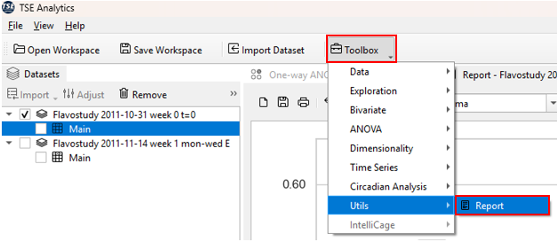

This will open the Report interface in your software window. The report interface functions like a blank notebook, ready to receive analysis results.

### 2. Adding Analysis Results to the Report

Once an analysis is completed (e.g., ANOVA, Tukey test, mean, standard deviation), click the *Add to Report* button located at the top right of the interface.The selected results will be added to the Report Window, forming your experimental "data notebook".

Repeat this process to compile multiple analyses into a single report.

Within the Report Window, you can further organize and customize all added data and charts, including reordering content, modifying titles, adding annotations, and other editing functions.

After the report is finalized, it can be exported or printed for documentation, record-keeping, or publication purposes.

!!! note
    When performing data analysis, if you click *Add to Report* and nothing appears to happen, your data has actually been successfully added to the report. The reason nothing is visible is that the Report Window is not currently open or active. To view the report, open the **Report Window** by navigating to:**Toolbox → Utils → Report**.

### 3. Example Workflow

Suppose you have performed One-way ANOVA and Regression analyse on your dataset and want to consolidate the results into a report:
1. Open the Report Window: **Toolbox → Utils → Report**
2. Perform One-way ANOVA: **Toolbox → ANOVA → One-way ANOVA**. Once the analysis is complete, click *Add to Report*.
3. Perform Regression Analysis on the same dataset: **Toolbox → Bivariate → Regression**. After completion, click *Add to Report* again. The results are automatically added to the report.
4. Continue adding additional analyses as needed. Within the **Report Window**, you can organize, edit, and customize all collected results.

Detailed instructions for using Regression, One-way ANOVA, and other statistical tools are provided in later chapters.

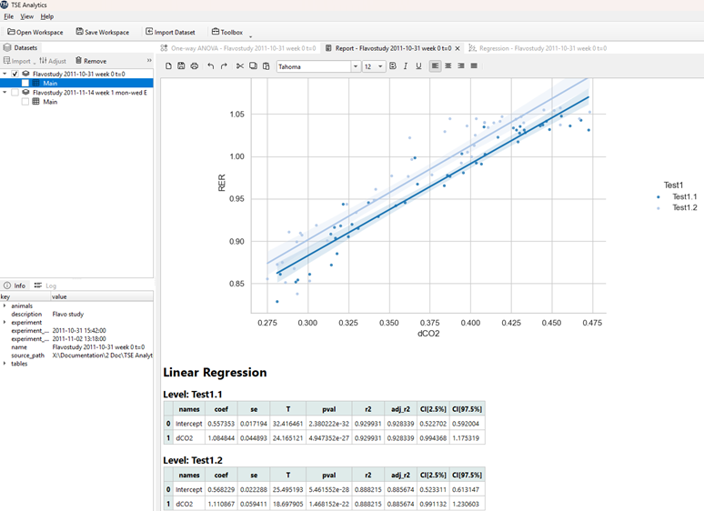

Each dataset has an individual report, and all reports are saved within a workspace in TSE Analytics when saving the workspace. 

All entries of an existing report are cleared by clicking the **New Report** button (‘Sheet’ symbol) on the left of the report menu.

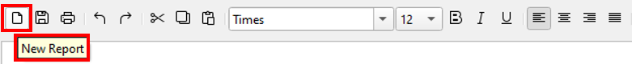

!!! warning
    This action cannot be undone! Clicking **New Report** will definitively delete all previous content from the report.
