# Data Import

## Export data from PhenoMaster software

TSE Analytics ONLY supports TSE Dataset files (.tse), which are experimental date files exported from PhenoMaster Specific Software Version.

First, in PhenoMaster Software, click the *Export* menu, the following submenu will then appear,choose *TSE Analytics*:

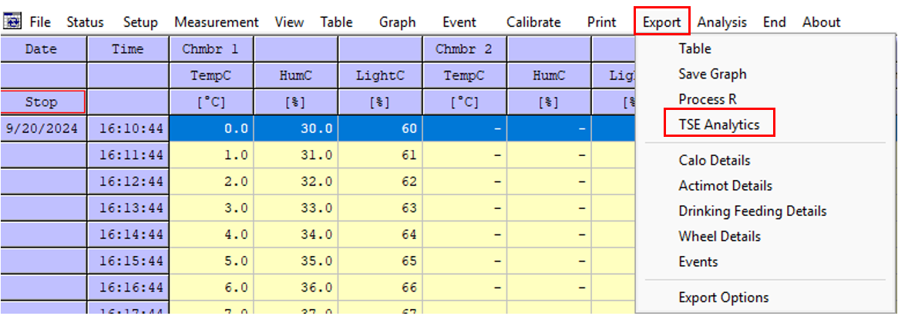

Next, select the required data types for export:

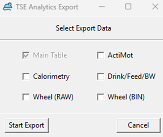

At this stage, you may select additional data types: Act.raw (ActiMot), Calo.bin (calorimetry), and DFT.bin (DrinkFeed). If the BodyWeight module is licensed, the DFT.bin file will also include body weight data.

Once all selections have been made, click Start Export. A dialog box will appear:

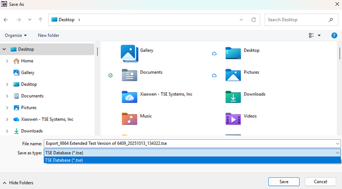

By default, the exported file name is automatically generated according to the following format:
Export + Project ID (may include additional identifiers, e.g., PW for PhenoWorld) + YYYY/MM/DD + HH/MM/SS + .tse file extension

Click Save to begin the export process. The export operation can be aborted at any time by clicking *Cancel*.

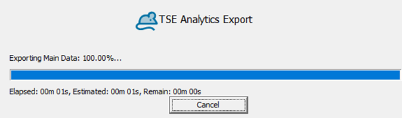

Upon successful completion, a confirmation message will be displayed:

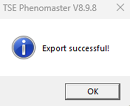

## Import Data into TSE Analytics

Datasets exported from PhenoMaster Software as described above (file ending **.tse**)can be imported into TSE Analytics via **File | Import Dataset** in the header or via the Import Dataset button.
The **.tse** dataset exported from the PhenoMaster software can then be selected in the File Explorer and is loaded into TSE Analytics upon clicking **Open**.

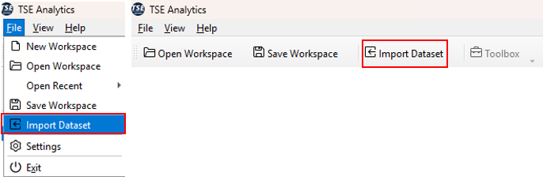

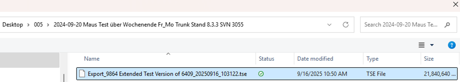

During the import process, you can further filter or select the data types to be imported.

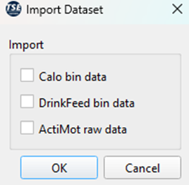

>**Note**:
If the data import takes an unusually long time or fails to complete, this may be due to the large size of the dataset. To ensure a smooth import process, it is recommended to select only the data types that are required for your analysis.
{style='note'}

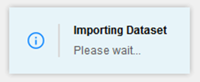

After successful import, the dataset will appear in the Dataset widget. The dataset will only be displayed if the Dataset widget is activated (indicated by checked tick box) under **View**.

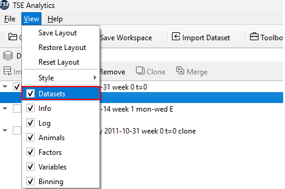

## Data Overview and Visualization

Once your dataset has been successfully imported and is active in the software, you can review and visualize the data to gain an initial understanding of its structure and content.

**1. Select the Dataset**

In the main interface, select the Dataset you wish to inspect.
Make sure to also select the corresponding widget *Main* entry under the dataset.

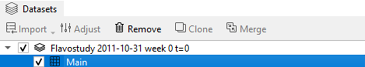

**2. Open Data View**

Navigate to **Toolbox → Data** Widget.
**Double-click** *Table* to display the data in tabular form, or **double-click** *Plot* to visualize the data graphically.

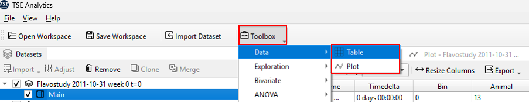

**3. Switch Between Display Modes**

To explore different statistical views or display options of the same dataset, simply return to **Toolbox → Data**Widget and choose the desired visualization or analysis method.

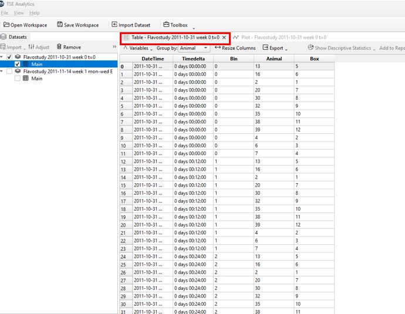

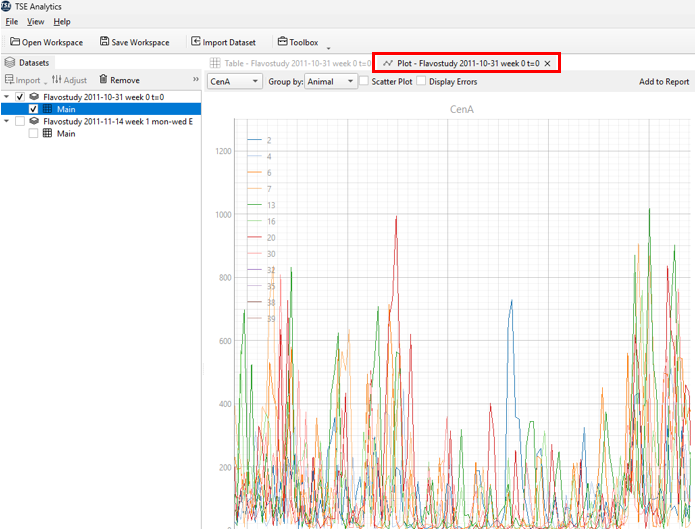

**Multiple datasets** can be imported into TSE Analytics one after the other, but not simultaneously.
Each dataset that has been loaded into TSE Analytics becomes part of the current Workspace and contains a set of individual settings. 

All relevant data, such as sampling intervals, animal information and variables list are extracted automatically during import individually for each dataset. 
There is no limit to the number of datasets that can be loaded into a workspace. 

A dataset can be selected for data processing and analysis by clicking on the respective dataset in the Dataset widget.
The active dataset is then highlighted in colour, and all other widgets will be updated accordingly. 

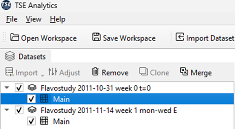

> **Note**: Only one dataset can be active (highlighted in colour) at one time in the workspace.
{style='note'}
