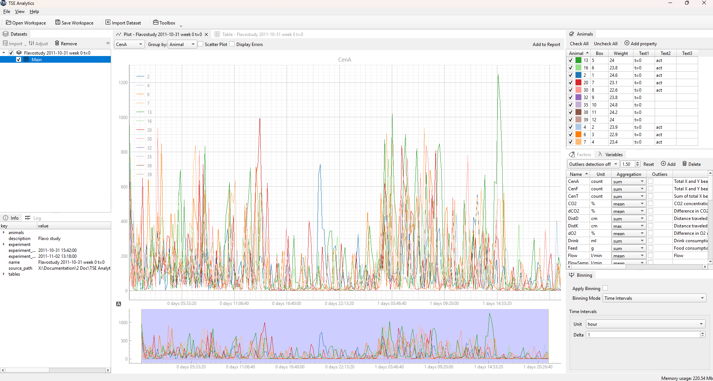
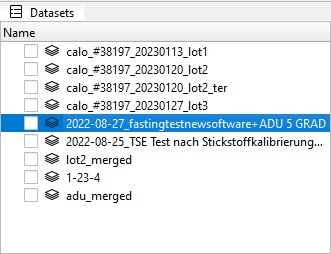

# Get Started

Main window of TSE Analytics is a host of multiple dockable widgets. Users may resize, move and organize the layout
of the main application window up to their liking. Users can hide/show some widgets by using **View** section
in the main menu.

The layout is saved when you quit the application.

> **Note**: Default layout can be restored by clicking **View | Reset Layout** menu command.
{style='note'}



## Data structure

All data in the application are organized in the following manner:

```
├── Workspace
│   ├── Dataset 1
│   │   ├── Metadata 1
│   │   ├── Animals set 1
│   │   ├── Variables set 1
│   │   ├── Factors set 1
│   │   ├── Settings 1
│   ├── Dataset 2
│   │   ├── Metadata 2
│   │   ├── Animals set 2
│   │   ├── Variables set 2
│   │   ├── Factors set 2
│   │   ├── Settings 2
│   ├── Dataset ...
│   │   ├── Metadata ...
│   │   ├── Animals set ...
│   │   ├── Variables set ...
│   │   ├── Factors set ...
│   │   ├── Settings ...
```

Top level data structure is a *Workspace*. It can contain one or many datasets.

To import dataset, please click **File | Import Dataset** command. As soon as data from CSV file are imported,
you will see a new entry in the *Datasets* widget. By selecting a specific entry in this widget, one can switch freely
between different datasets:



> **Note**: Only one dataset can be active at a time in the workspace!
{style='note'}

When dataset is selected, all other widgets will be updated accordingly: for example, **Info**, **Animals**,
**Variables** and **Factors** widgets will show information relevant to the active (currently selected) dataset.

## Data Analysis Pipeline

The data analysis pipeline defines the internal logic by which the software processes and prepares raw data before it is used by any analytical or visualization widget.
In other words, it represents the sequence of operations that transform raw experimental data into a consistent and analysis-ready form.
This ensures that all widgets work with the same filtered, cleaned, and time-aligned dataset, providing consistent analytical results across the application.
### 1. Animal Filtering
The system selects data only for the animals chosen in the **Animals** widget.This allows users to focus on a specific subset of animals for analysis.
### 2. Outlier Removal
The pipeline can remove outlier values — data points that are statistically abnormal or likely due to measurement errors.  
This step can be enabled or disabled in the **Outliers** widget.
### 3. Time Binning
The data are grouped into defined time intervals (“bins”), simplifying temporal analysis and making it easier to observe behavioral trends over time.

Each of these preprocessing stages is described in detail in the following sections.

> **Note**: If you observe some strange results during your analysis, please check that proper animals are selected in **Animals** widget!
{style='note'}
