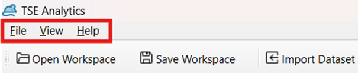
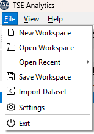
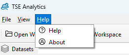
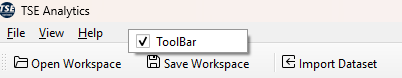

# Main Menu

The main menu comprises file import, save and export functions under **File**, view settings under **View** and access to additional information and support under **Help**.

**File**
-	Open Workspace/ Open Recent: Open an existing (recently used) workspace.
-	Save Workspace: Save the current workspace.
-	Import Dataset: Import an individual dataset.
-	Settings: Use online/offline help.
-	Exit: Close the application. 

> **Important**: *Exit* command will save any changes regarding the software layout but will not automatically save the workspace or any other changes.
{style='warning'}

**View**

- Save Layout: Saves the current window arrangement, size, and visibility. Useful after setting up your preferred workspace layout.
- Reset layout: Restores a previously saved layout configuration, returning the interface to a familiar arrangement.
- Reset Layout: Resets the workspace to the default layout. Helpful if windows become misplaced or accidentally closed.
- Style: Allows changing the visual style or theme of the interface.
- View Panels (Datasets / Info / Log / Animals / Factors / Variables / Binning): Toggles the visibility of different panels. Checked items are displayed in the main interface; unchecked ones are hidden.

**Help**

- Help: Access support manual resource or contact customer support.
- About: View information about the software version.

> **Note:** If the toolbar disappears, and you can't find the following widgets: Open Workspace, Save Workspace, Import Dataset, and Add Widget, it is likely that the toolbar has been hidden. To restore the toolbar, right-click on the main menu and select the option to display the toolbar again.
> {style = 'note'}

