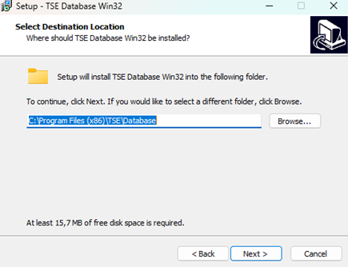
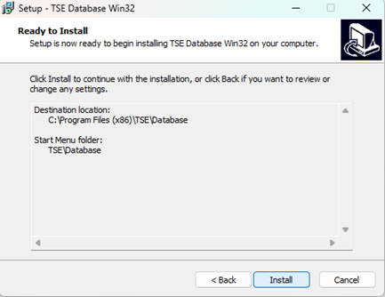
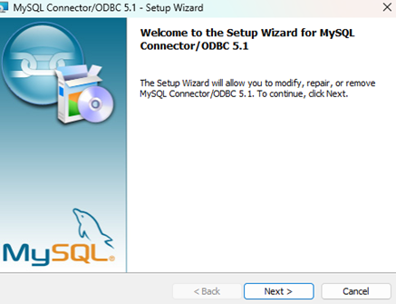
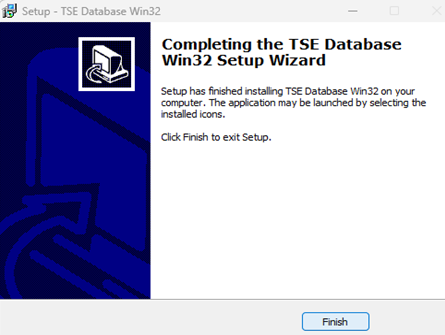
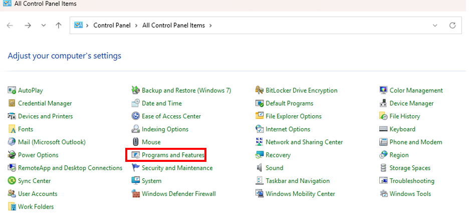
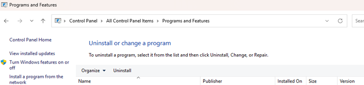

# Installation

## System Requirements

Before installing TSE Analytics, ensure your system meets the following minimum requirements:

**Hardware:**

- Operating System: Windows 10 or 11 (64-bit)
- Processor: Intel Core i7/i9, AMD Ryzen or equivalent
- CPU: Minimum 4 CPU cores (high CPU clock speed is highly recommended)
- RAM: Minimum 16 Gb (some types of analysis, for example ActiMot, may require more)
- Display: 1920×1080 or higher is recommended
- Storage: SSD
- Disk Space: 700 Mb of free space for installation; 10 Gb or more free space recommended for smooth data handling

!!! note
    TSE Analytics can ONLY be used in combination with the PhenoMaster software-specific version for designated customers.
    If you have any further questions, please contact [TSE Service](https://www.tse-systems.com/support/).

## Installation

1. **Locate the Installer**: Navigate to the folder where the installer file was downloaded.

2. **Run the Installer**: Double-click the installer file.

3. **Installation Wizard**: Follow the on-screen instructions provided by the installation wizard.

4. **Installation Directory**: Choose the installation directory or use the default path and choose whether to create a desktop shortcut.

## Uninstallation

Go to **Control Panel** > **Programs** > **Uninstall a program**. Select “TSE Analytics” in the list of installed programs and click "Uninstall."

!!! tip
    Please ensure to save all open workspaces and export all relevant data before uninstalling TSE Analytics.
    Data which has not been saved on your device cannot be restored after uninstallation.
