# Datasets

**Data processing in the Dataset Widget**

Several tools for editing and preprocessing a selected dataset are available in the header of the Dataset widget. Those include **adjusting** a dataset in the Adjust Dataset window, **removing** a dataset from the Dataset widget, creating a copy (**cloning**) of a dataset and **merging** of datasets.

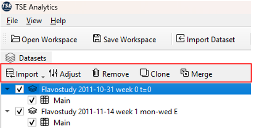

## Import

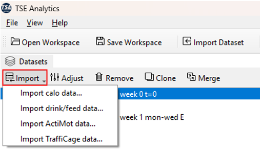

## Adjust

The _Adjust Dataset_ window offers multipe tools for editing a dataset and selecting time phases and animals of interest. To open the _Adjust Dataset_ window, select the respective dataset from the dataset list (selected dataset highlighted in blue) and and click **Adjust** in the _Dataset_ header.

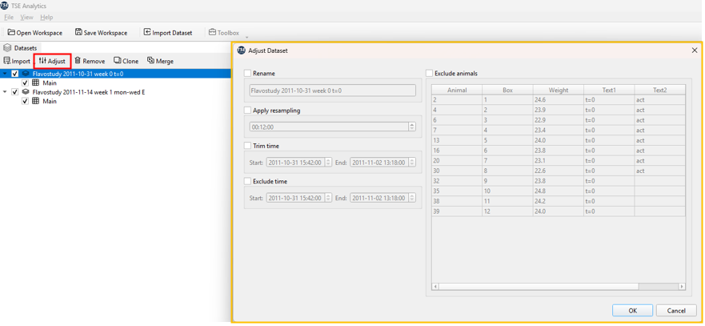

To activate a tool for dataset editing, check the corresponding checkbox. The following operations are available:

- **Rename**: The dataset can be renamed by entering a new dataset name in the text field underneath.

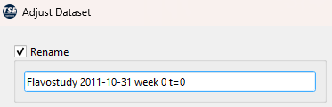

- **Apply resampling**: A new sample interval can be defined by typing in a new time interval using the format ‘hh:mm:ss’ or by using the arrows on the right.

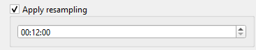

!!! note
    New sample intervals cannot be shorter than the original sample interval during the measurement.

- **Trim time**: The date and time of the start and the end of a dataset can be changed here to shorten the time span covered by the dataset. Thereby, data from the beginning and the end of an experiment can be excluded.

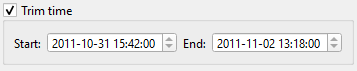

!!! note
    The start time cannot be a time before the actual start of the experiment, and the end time cannot be a time after the actual end of the experiment.

The example below shows time trimming via the exclusion of a time phase at the beginning of an experiment (changing the start time).

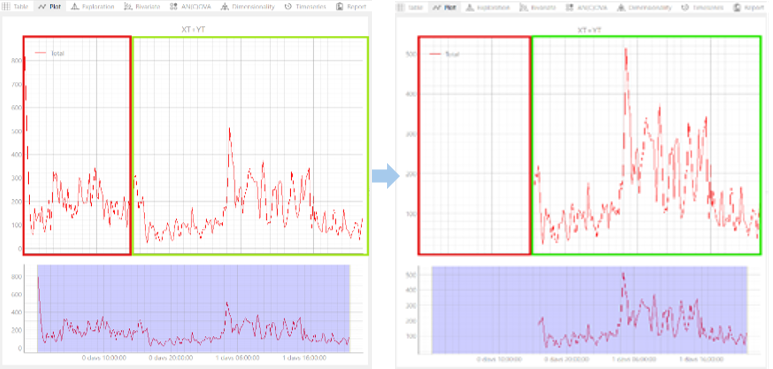

- **Exclude time**: A custom time phase (at the beginning, the end or in the middle of an experiment) can be excluded by defining the start and the end time of the time phase that should be excluded.

!!! note
    The start time of the excluded phase must fall within the experiment’s duration.
    The end time must be later than the start time and not beyond the experiment’s end.

- **Exclude animals**: Animals which should be permanently excluded from the dataset together with all associated data can be selected from the animals list. Selected animals are highlighted in blue.

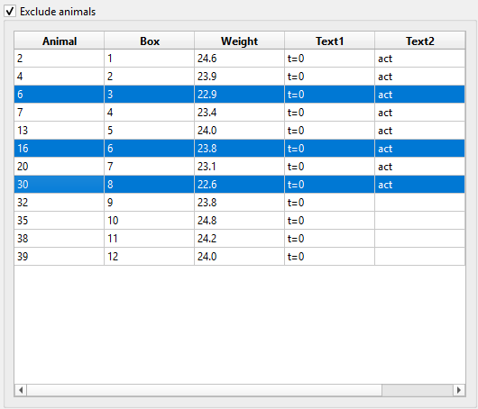

To apply changes specified in the _Adjust Dataset_ window to the selected dataset, click **OK**.

!!! warning
    Changes regarding the trimming or exclusion of time phases as well as exclusion of animals cannot be undone once they have been applied (by clicking **OK**). It is recommended to create a clone of a dataset before making adjustments as a backup.

!!! note
    All changes made via the _Adjust Dataset_ window will only be applied to the dataset within TSE Analytics but do not affect the original dataset stored outside of TSE Analytics.

## Remove

To remove a dataset, select the respective dataset from the dataset list (selected dataset highlighted in blue) and click **Remove** in the header of the _Dataset_ widget.
Click **Yes** in the popup window to confirm that the dataset should be removed.

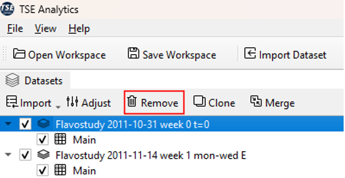

!!! warning
    *Remove* will remove the chosen dataset including all changes, analysis results and reports permanently from the currently active workspace. Removed datasets cannot be restored.

!!! note
    *Remove* does not affect the original dataset stored outside TSE Analytics.

## Clone

To create a copy of a dataset, select the respective dataset from the dataset list (selected dataset highlighted in blue) and click **Clone** in the header of the _Dataset_ widget. The name of the dataset clone can be changed in the pop-up window and is applied upon clicking **OK**. The default name for a dataset clone is ‘Clone of \[name of original dataset]’.

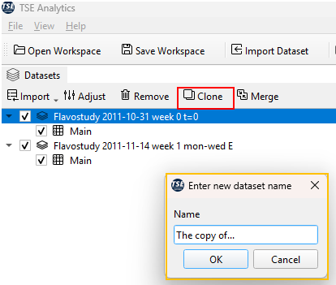

!!! note
    Cloning a dataset will apply all changes that have been applied to the original dataset also to the newly created clone. This affects the exclusion of animals and times, adjusting time, animal selection, factors, time binning settings, outlier detections settings, report, and analysis settings.

## Merge

Two or more datasets can be merged by selecting the desired datasets in the *Dataset* widget using the checkbox on the left-hand side of the dataset list.
To open the Merge Datasets dialog window, click **Merge** in the header of the Dataset widget.

!!! note
    The **Merge** button is only active when two or more datasets are selected via the checkbox of the *Datasets* widget.

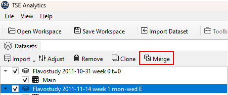

In this dialogue window, datasets can be adjusted individually via the *Adjust* button to prepare and match all selected datasets for **Data merging**.
Clicking *Adjust* opens the Adjust Dataset window, which provides options to rename a dataset, apply resampling, trim time, exclude time, and exclude animals for each dataset individually.

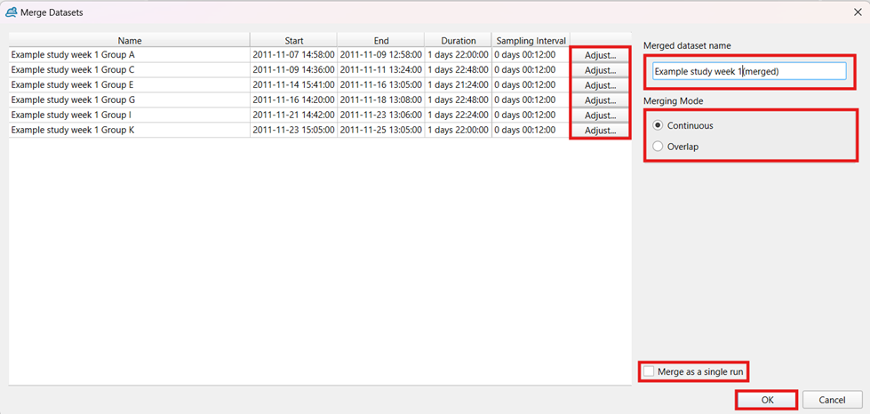

The adjustment interface and available functionalities in this dialogue are consistent with those presented in the previous section **Datasets Adjust**.

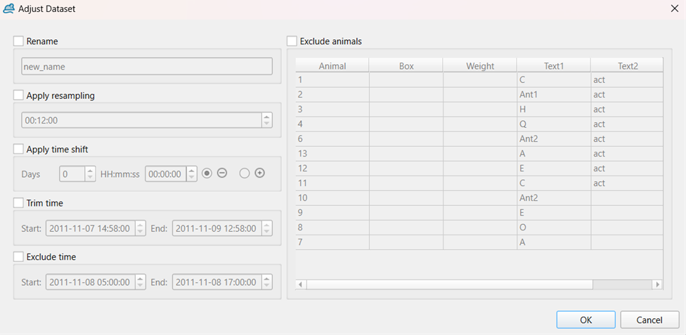

Merging can be performed using either the “Continuous” or “Overlap” mode, which can be selected under **Merging Mode**.

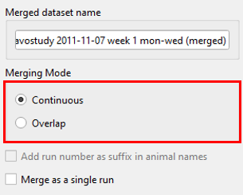

- “**Continuous**” mode:

Datasets are merged under consideration of the absolute time data stamps (date and time of the experiment) and are displayed one after each other if experiments have been performed after each other.

- “**Overlap**” mode:

Datasets are merged under consideration of relative timestamps, i.e., time delta since the start of the experiment, and aligned according to their time bins. Datasets are displayed within the same time frame.

!!! note
    If *Overlap* mode is selected, the option ‘Add run number as suffix in animal names’ is available and can be activated by ticking the check box. Activating this option during merging is necessary, if animal names of the individual datasets are identical.

In addition, datasets can be merged as a single run (no differentiation between individual datasets after merging) or as individual runs (possibility to split merged dataset by run to distinguish between individual datasets during analysis). To merge datasets as a single run, the check box **Merge as a single run** needs to be ticked.

After adjusting settings in the _Merge Dataset_ dialogue window, click **OK** to create a merged dataset.

!!! warning
    Settings for merging and adjusting individual datasets cannot be changed anymore, once the merged dataset has been created. Please ensure all adjustments and settings have been chosen correctly before clicking OK.

!!! note
    Datasets can only be merged if the lists of variables are identical.
    This applies to the individual variables contained in a dataset as well as variable settings specified in the _Variables_ widget (aggregation mode and selection of variables for outlier detection).
    In case of discrepancies between variable settings, aggregation modes and selection of variables for outlier detection can be reset to default by clicking **Reset** in the header of the _Variables_ widget.
