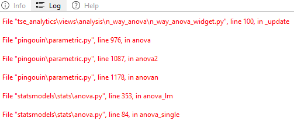

# Log
The *Info, Help, and Log* panel, located in the lower-left corner of the TSE analytic software interface, as metadata window, is designed to provide auxiliary support during data analysis and software using. This panel consists of three key widgets: **Info**, which displays metadata related to the source data for enhanced contextual understanding the datasource; **Help**, offering electronic user guidance tailored to the active functionality or tool in use; **Log**, where system program logs are recorded, allowing users to monitor system activities and troubleshoot as needed. 

- **Log**: Error messages and warnings regarding the software code executed are displayed here. In case of any malfunction of the software, please inform TSE Systems about error messages shown here.

