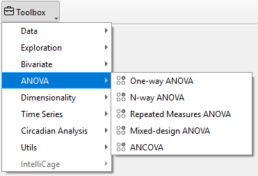

# ANOVA

The **ANOVA** widgets offer multiple options for the Analysis of Variances (ANOVA) including One-Way ANOVA, N-Way ANOVA, repeated measures ANOVA, mixed design ANOVA and Analysis of Covariance (ANCOVA).

Settings for AN(C)OVA calculations can be adjusted in the control panel of the AN(C)OVA widget:
- The respective analysis (One-Way ANOVA, N-Way ANOVA, repeated measures ANOVA, mixed design ANOVA, ANCOVA) can be chosen under **ANCOVA**. 
- One factor (one-way ANOVA, mixed ANOVA, ANCOVA) or multiple factors (N-way ANOVA) can be selected from the **Factors** list. 
- The variable of interest is selected from the variables list under **Dependent Variable**. 
- For the calculation of effect sizes, the **Effect size type** can be selected from the respective dropdown menu. The available effect size types are: unbiased Cohen d, Hedges g, eta-square, odds ratio, area under the curve and common language effect size. 
- A dropdown menu to choose a method for **P-value adjustment** is available for N-way ANOVA, repeated measures ANOVA, mixed-design ANOVA and ANCOVA. Different methods for p-value adjustment include one-step Bonferroni, one-step Sidak, step-down Bonferroni, Benjamini/Hochberg FDR (false discovery rate) and Benjamini/Yekutieli FDR (false discovery rate). 

OVA widget.png)

!!! note
    For one-way ANOVA, p-value correction of pairwise comparisons is determined by the type of ANOVA (depending on homoscedasticity) and cannot be adjusted manually.
 
    P-value adjustment is only applied in the case of more than one pairwise comparison.
  
To show ANOVA results or to apply changes, click **Update** in the control panel. Result tables will not update automatically.

ANOVA results as displayed in the AN(C)OVA widget can be added to the report by clicking **Add to Report** in the control panel.

!!! warning
    Only animals selected in the Animal list are considered for the calculation of AN(C)OVA analysis results in the AN(C)OVA widget.
    Changes regarding the selection of animals are only applied after clicking **Update**.

The displayed graphs can be saved together in the current active workspace for further editing or export by clicking **Add to Report**.
For detailed instructions, refer to the section ***“Editing and Exporting Analysis Results (Via Report)”*** in the *“Getting Started – Data Export”* chapter.

 

