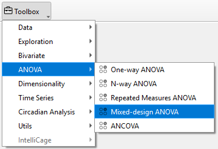
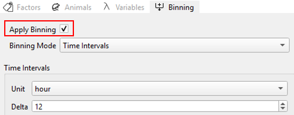
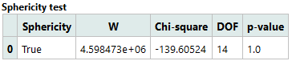
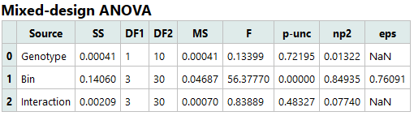
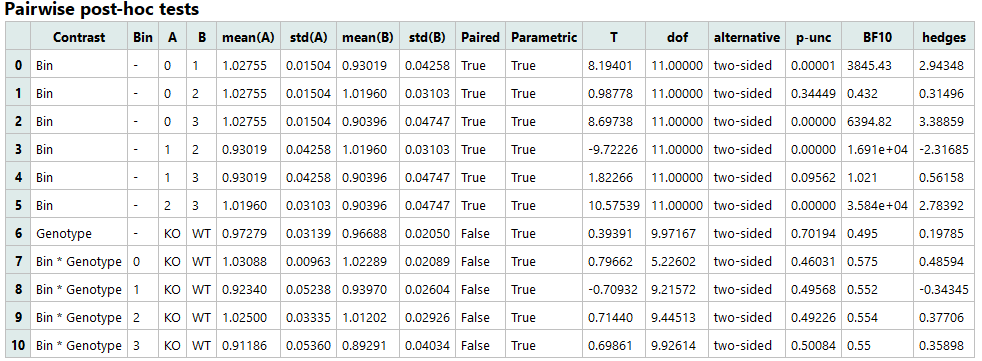
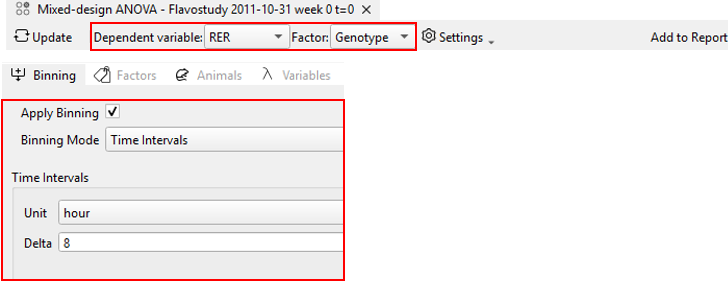
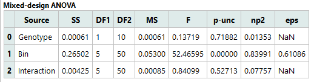
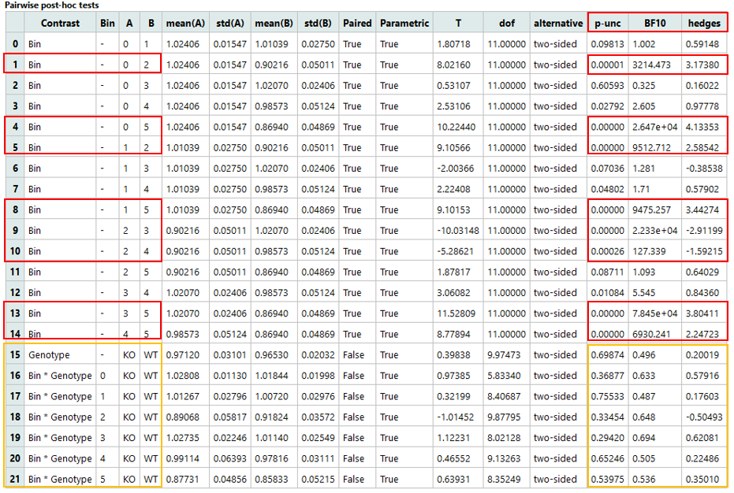

# Mixed-design ANOVA

Mixed-design ANOVA can be used to determine the effects of within-subject factors (see repeated measure ANOVA) and between-subject factors (see one-way and N-way ANOVA) as well as their interactions on a dependent variable. 

In TSE Analytics, (two-way) mixed-design ANOVA is performed using the within-subject factor “time bin” (depending on the selected time binning settings) and one between-subject factor as determined in the factors list.
To perform mixed-design ANOVA, select the respective data set from the *Add widget* and choose **Mixed-design ANOVA** as the analysis **Mode** in the AN(C)OVA control panel. 

**Apply (Time) Binning** using the binning mode which defines the repeated measures, i.e. bins, of interest.
Select a between-subject factor from the **Factors** list and choose a variable from the **Dependent Variable** list.
If needed, a **P-values adjustment** method and **Effect size type** can be selected from the respective dropdown menu.
Analysis results are calculated according to the selected settings by clicking **Update**.

!!! note
    Mixed-design ANOVA can only be performed if **Time Binning** is applied.

Analysis result tables for repeated measures ANOVA include:

**Sphericity test:**

- Sphericity: True, if data has the sphericity property.
- W: Test statistic
- Chi-square: Chi-square statistic
- DOF: Degrees of freedom
- p-value: p-value

**Mixed-design ANOVA:**

- Source: Names of the factors or interaction
- SS: Sum of squares
- DF1: Degrees of freedom (numerator)
- DF2: Degrees of freedom (denominator)
- MS: Mean squares
- F: F-value
- p-unc: Uncorrected p-value
- np2: Partial eta-squared effect sizes
- eps: Greenhouse-Geisser epsilon factor (= index of sphericity)

**Pairwise post-hoc tests:**

- Contrast: Factors or interaction
- A: Name of first measurement
- B: Name of second measurement
- mean(A): Mean of the second measurement
- std(A): Standard deviation of the second measurement
- mean(B): Mean of the second measurement
- std(B): Standard deviation of the second factor group
- Paired: Indicates whether the two measurements are paired or independent
- Parametric: Indicates if parametric tests were used
- T: T statistic
- dof: Degrees of freedom (only if parametric=True)
- alternative: Tail of the test
- p-unc: Uncorrected p-values
- p-corr: Corrected p-values
- p-adjust: p-values correction method
- BF10: Bayes Factor
- effect size type: Effect size as defined in “Effect size type” dropdown menu

!!! note
    Pairwise comparisons can only be calculated within time bins (comparing between-subject factors within individual time bins, but not comparing time bins within factor groups).

!!! warning
    The time needed to calculate pairwise comparison results for mixed-design ANOVA increases with the number of time bins.
    In case of binning by time intervals, calculation of ANOVA results might take several minutes depending on the computer’s computing power.
    Therefore, when performing mixed-design ANOVA using time binning by time intervals, users can choose whether pairwise comparisons should be performed in a pop-up window.

## Example Interpretation

This example uses a Mixed-Design ANOVA to analyze respiratory exchange ratio (RER) measured in animals using the Phenomaster system, comparing two genotypes (WT vs KO) across different time bins.

**1. Sphericity Test**

This table examines whether the within-subject factor (Bin) meets the sphericity assumption required for Mixed-Design ANOVA. Since the p-value is not significant, sphericity is considered satisfied.

**2. Mixed-Design ANOVA** 

This table reports the main effects and interaction from the Mixed-Design ANOVA:

- **Genotype (between-subjects)**:  **p = 0.71882**
→ **No significant overall difference in RER between WT and KO**; effect size is negligible.

- **Time Bin (within-subjects)**: **p < 0.00001 (reported as 0.00000)**
→ **Highly significant main effect of Time**: RER differs across time bins with a very large effect size.

- **Genotype × Time Bin interaction**: **p = 0.52713**
→ No significant interaction; there is no evidence that the temporal profile of RER differs between genotypes.

**3. Pairwise host-hoc tests**

- **Certain time bins (e.g., Bin 0 vs Bin 2)** show significant changes over time (**p < 0.05**), indicating localized temporal RER variation.

- **Comparisons between genotypes at each time point** are not significant (**p > 0.05**), suggesting no RER difference between WT and KO in any individual bin.

- Overall, KO and WT exhibit similar RER, which remains relatively stable over time; temporal patterns may slightly differ, but current evidence is not strong.

In summary, in this example, there is no overall difference in RER between the KO and WT groups, and RER remains largely stable over time. Although the temporal profiles of the two groups may show slight differences, the evidence is not strong enough to support a significant effect.
