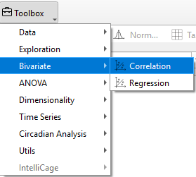
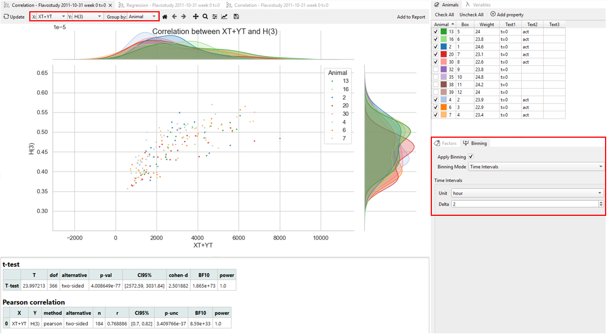
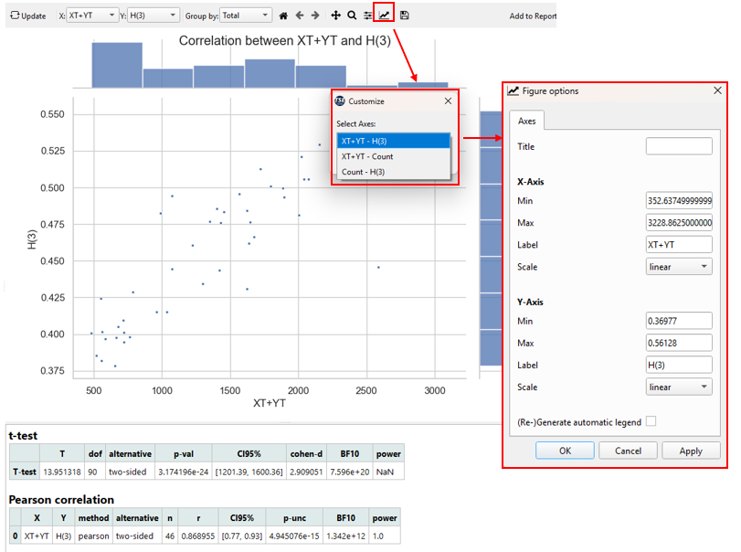
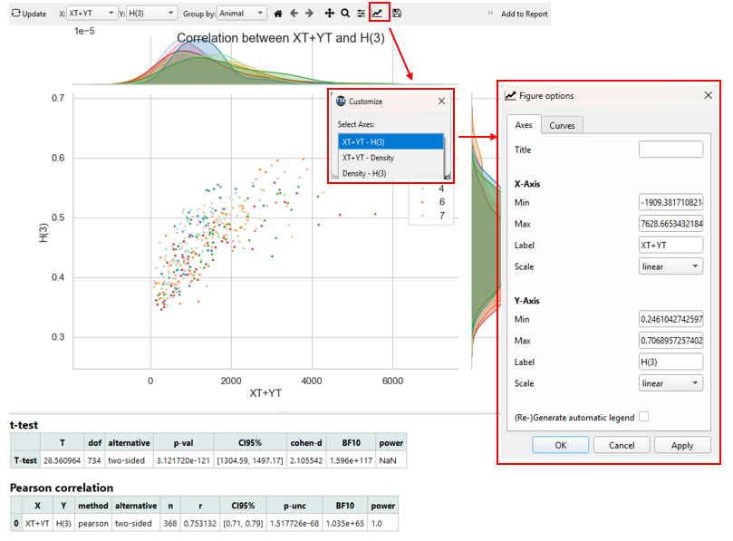
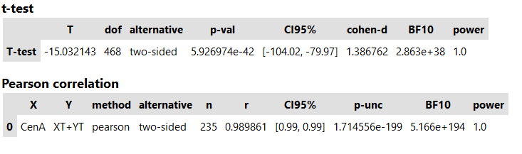
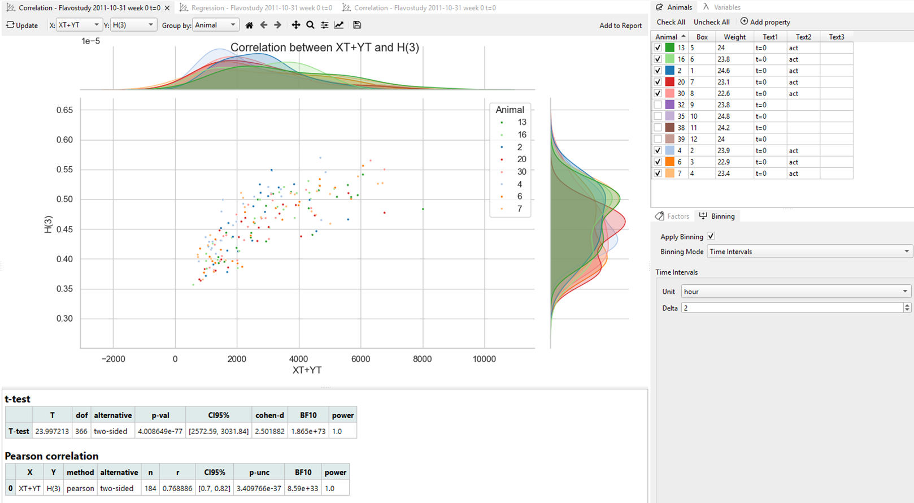

# Correlation

**Correlation analysis** is used to determine the strength and direction of the linear relationship between two variables, X and Y.
 
In TSE Analytics, the results are displayed as a scatter plot of all data pairs, along with individual density plots or histograms for each variable. Pearson's correlation coefficient is then calculated to quantify the strength and direction of this relationship. T-test statistics are used to assess the statistical significance of the correlation coefficient. Correlation analysis helps researchers identify significant associations between variables, guiding the further interpretation of experimental data.

## Correlation plots

Data pairs for each time bin are depicted as dots in the **scatter plot** and are dependent on the selected variables, groups and time binning settings.

**Histograms/ Density plots** represent how frequently different values occur for each variable. The plots are drawn along the axis corresponding to the variable, and the way the data is grouped and time-binned is taken into account.

!!! note
    Histograms are only shown when the data is grouped by “Total.” If the data is split into subsets (for example, by Animal or Factor), histograms are not used. Instead, a separate density curve is drawn for each subset.

To adjust the appearance of a plot, use the **‘Customize’** tool (‘Graph’ symbol) in the plot menu and select the respective plot from the drop-down menu (**“[Variable X] – [Variable Y]”** for scatter plot and **“[Variable X] – Count/Density”** or **“Count/Density – [Variable Y]”** for density plots/ histograms).

- The title, as well as range, label and scale of axis and plot legend generation of individual plots can be defined in the **Axes tab** of the Customize tool.
- In the case of multiple animals, runs or groups (for split modes By Animal, By Run or By Factor, respectively), the appearance of each data subset can be adjusted individually in the **Curves tab** of the ‘Customize’ tool by selecting the respective subset form the upper
  dropdown menu.

## Correlation results table

Correlation analysis results are calculated based on the (mean) data values per time bin depending on the respective split mode.

The **T-test statistics** comparing the X and Y variable include (from left to right):

- T: T-value
- dof: Degrees of freedom
- alternative: Tail of the test (two-sided)
- p-val: p-value
- CI95%: Confidence intervals of the difference in means
- cohen-d: Cohen d effect size
- BF10: Bayes factor of the alternative hypothesis
- power: Achieved power of the test (= 1 - type II error)

The **Pearson correlation** coefficient table indicates (from left to right):

-	X: Selected X variable
-	Y: Selected Y variable
-	method: Method of correlation analysis (pearson)
-	alternative: Tail of the test (two-sided)
-	n: Sample size (number of data pairs)
-	r: Correlation coefficient
-	CI95%: 95% parametric confidence intervals
-	p-unc: Uncorrected p-value
-	BF10: Bayes factor of the alternative hypothesis
-	power: Achieved power of the test (= 1 - type II error)

## Example Interpretation

The figure below shows the correlation between XT+YT (sum of X and Y beam interruptions, representing locomotor activity) and H(3) (heat production) measured by the PhenoMaster system.

In this plot:

- Each **dot** represents one data pair (XT+YT and H(3)) averaged over a 2-hour time bin.

- Different **colors** correspond to individual animals.

- The **x-axis** shows the XT+YT values (activity).

- The **y-axis** shows the H(3) values (heat production).

- The **density plots** along the axes display the value distributions for each variable and animal group.

The **T-test** yielded a very large **t-value (t = 23.99)** with an extremely small **p-value (p = 4.0 × 10⁻⁷⁷)**, well below conventional significance threshold(**p < 0.001**). The high effect size (**Cohen’s d = 2.50**) and full statistical power indicate that the observed difference is highly significant and unlikely to result from random variation.

**Pearson correlation** analysis confirmed a strong linear association between activity and heat production (**r = 0.77, 95% CI [0.70, 0.82]**), supported by robust **Bayesian evidence (BF10 ≫ 1)** and a sufficient sample size.

These results demonstrate that **more active mice produce more heat**, reflecting **increased metabolic energy expenditure** during movement, consistent with the expected physiological relationship between **activity and metabolism**.
