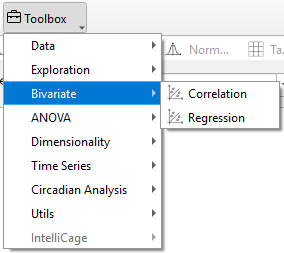
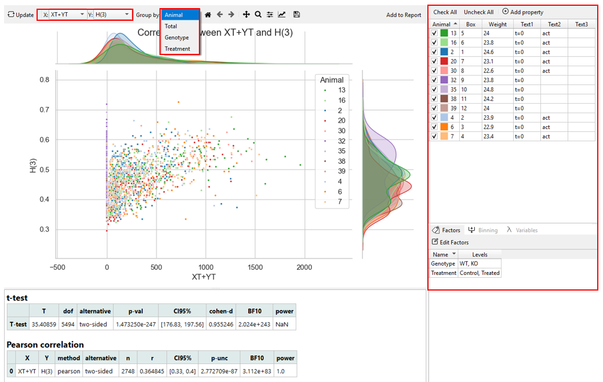

# Bivariate Widgets

Bivariate analysis allows researchers to examine relationships between two variables. In the Bivariate widget of TSE Analytics, **Correlation** and **Regression** methods can be used to assess the strength, direction, and predictive relationship between variables, helping to reveal meaningful associations in experimental data.

The type of analysis (**Correlation** or **Regression**) can be selected under **Bivariate** Widget. 
Two variables of interest can be selected from the dropdown menus **“X”** and **“Y”**

After selecting two variables, different groups can be chosen for analysis.
- **By Total**: All data entries for the respective variable are considered for plotting.
- **By Animal**: A plot for each animal is generated individually.
- **By Factor**: A plot for each group of the selected factor is generated. The corresponding factor setting is located at the bottom-right of the software interface.

To show plots and analysis results and to apply changes in the settings, click **Update** in the control panel. 
Both plots and analysis results displayed are added to the report upon clicking **Add to Report**.For detailed instructions, refer to the section ***“Editing and Exporting Analysis Results (Via Report)”*** in the *“Getting Started – Data Export”* chapter.

!!! warning
    Only animals selected in the Animal list are considered for the calculation of correlation and regression analysis in the Bivariate widget.
    Changes regarding the selection of animals are only applied after clicking **Update**.

To further customize the appearance of the generated plot, use the **Plot Menu** located above the graph. 
For detailed instructions, refer to the section ***“Customize the Appearance of the Result”*** in the *“Toolbox Widgets”* chapter.

The displayed graphs can be saved together in the current active workspace for further editing or export by clicking **Add to Report**. For detailed instructions, refer to the section ***“Editing and Exporting Analysis Results (Via Report)”*** in the *“Getting Started – Data Export”* chapter.
