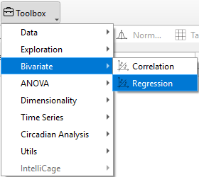
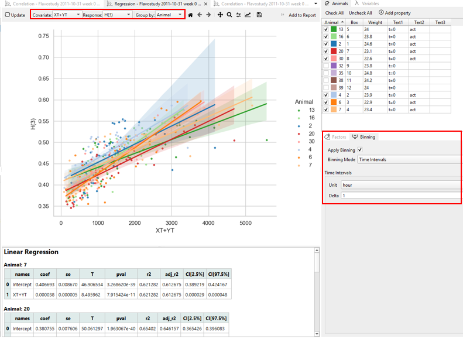
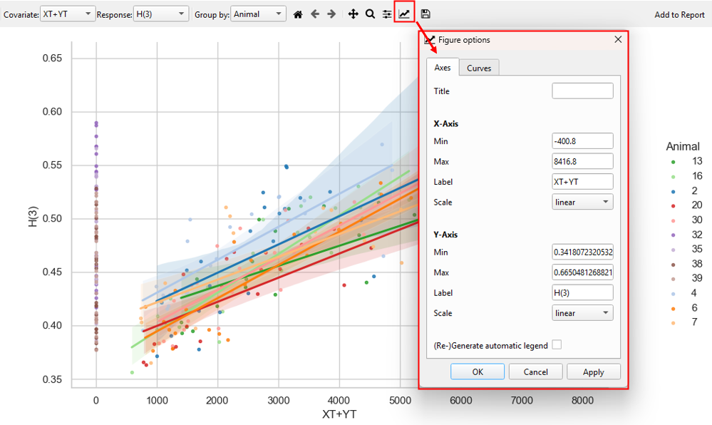
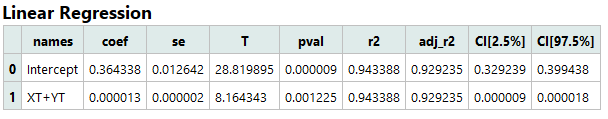

# Regression

**Regression** analysis is used to model and quantify the relationship between **variable** and **covariate**. Regression aims to predict the value of the response based on the covariates and to understand the functional form of their relationship.

In TSE Analytics, results of a regression analysis are displayed as a regression plot with the fitted regression line overlaid, along with linear regression statistics for each covariate.
This analysis helps researchers make predictions, estimate effect sizes, and interpret the influence of covariates on the response outcome.

## Regression plot

The regression plot combines a **scatter plot** of data values for each time bin with a fitted **regression line** and its corresponding **confidence band** based on the plotted data. 

Data points for each time bin are shown as individual dots in the scatter plot, and their values depend on the selected **variables, groups, and time binning** settings.

**Customize Plots**:

- **Axes tab**: Set the title, axis labels, range, scale, and create an automatic legend.

- **Curves tab**: Adjust the appearance of regression lines. Each label corresponds to a different data subset.

## Regression results table

The linear regression table shows the statistical results of the linear regression, under consideration of the selected split mode and time binning settings:

Results include (from left to right):

- names: Name of the independent variable
- coef: Regression coefficients
- se: Standard errors
- T: T-values
- pval: p-values
- r2: Coefficient of determination (R2)
- adj_r2: Adjusted R2
- CI[2.5%]: Lower confidence intervals
- CI[97.5%]: Upper confidence intervals

If split mode ‘By Run’ or ‘By Factor’ is selected, a separate results table is displayed for each subset of data (for each run or group) in accordance with individual regression lines for each subset of data in the regression plot.

!!! note
    An intercept is added as a constant term to the model, to limit the bias and to force the residual mean to equal zero.
    The GLM table always contains a row for the intercept as its first entry including a coefficient and a p-value, however, these values are rarely meaningful.
