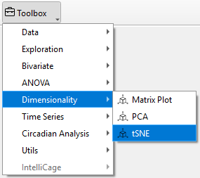
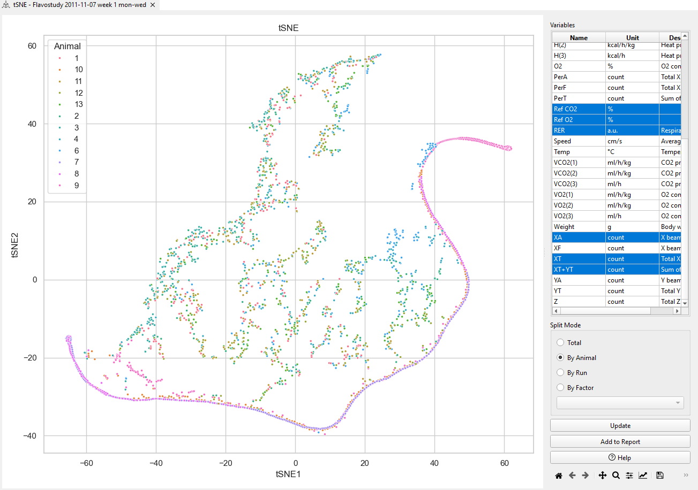
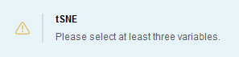

# t-SNE

t-Distributed Stochastic Neighbor Embedding (t-SNE) is a dimensionality reduction technique specifically designed for visualizing high-dimensional data in a lower-dimensional space (typically 2D or 3D).
It is particularly effective for embedding high-dimensional data into a space of two or three dimensions, which can then be visualized in a scatter plot.

To perform t-SNE in TSE Analytics, go to **Add Widget | Dimensionality | tSNE**. First, select the dataset you want to analyze from the left side of the interface. Then, in the *Variables list* on the right, choose at least two variables to explore their pairwise relationships. Users can specify the analysis dimension in the *Split Mode* section.Click **Update** to apply the tSNE and generate the results

**t-SNE Analysis**

- **Axis Description** :
**t-SNE1 (X-axis)** and **t-SNE2 (Y-axis)** are the axes of the 2D space created by the t-SNE algorithm, which reduces high-dimensional data into two dimensions for easier visualization.

- **Data Points**
Each data point represents an individual observation under specific experimental conditions, positioned based on its similarity to other points in the high-dimensional space.

- **Similarity of Data Points**
Points that are close together on the plot indicate that they are similar in the original high-dimensional data.  For example as the figure shown, **pink(Animal 8)** and **purple (Animal 9)** points are near each other, suggesting these two animals show similar characteristics or behaviors under the same experimental conditions.The **green (Animal 2)** and **blue (Animal 4)** points are far from each other in the plot, indicating that these two animals have different characteristics or behaviors under the experimental conditions.

!!! note
    The t-SNE algorithm requires at least three variables to accurately capture the complex relationships and high-dimensional structure of the data. Therefore, the software only supports the selection of at least **three or more variables** for tSNE analysis.
