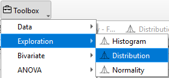
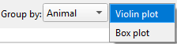
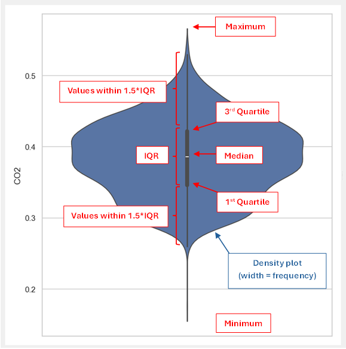
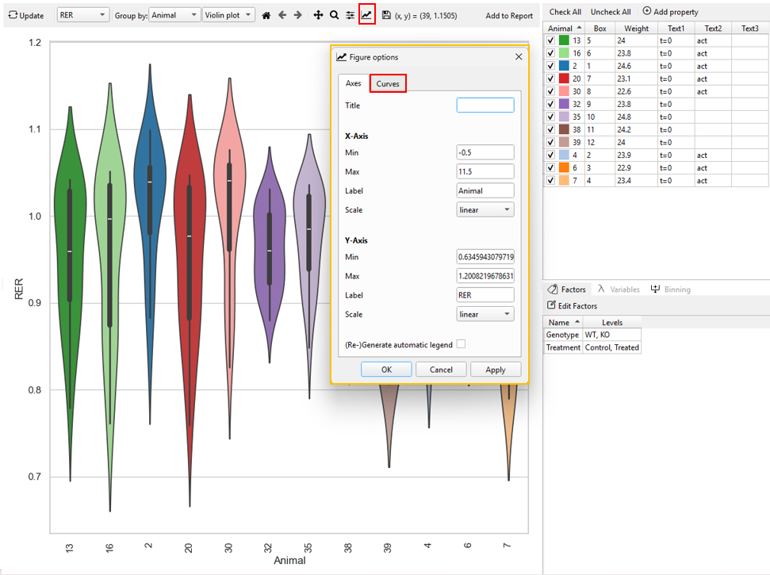
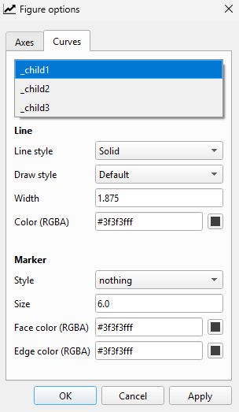
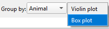
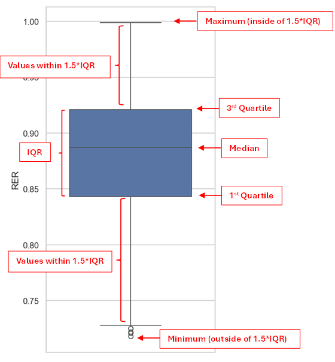
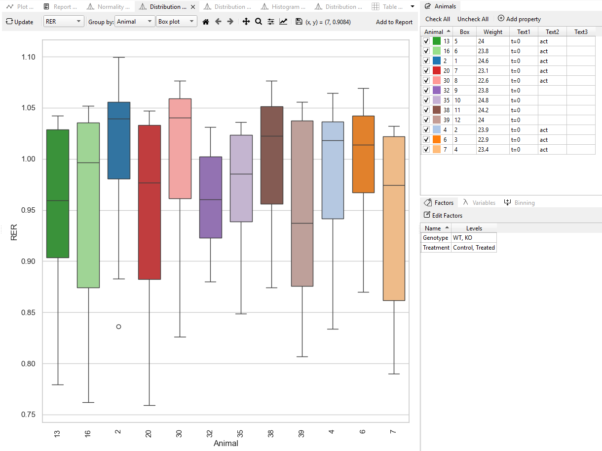

# Distribution
The Distribution plot displays how data are spread across different groups, enabling researchers to compare patterns, variability, and central tendencies between conditions.

In TSE Analytics, the **Distribution** can be examined by selecting Distribution under the **Exploration** widget, where **Box plot** and **Violin plot** are provided to illustrate group-level differences in data dispersion and shape.

## Violin plots

Violin plots can be generated in TSE Analytics by selecting
- **Plot type ‘Distribution’**
- and **Distribution as ‘Violin’** in the Exploration widget.

Violin plots represent the distribution of a selected dataset by combining density curves (blue) and box plots (dark grey).

- The width of each density curve indicates the approximate frequency of data points.
- The overlaid box plot (dark grey) shows the interquartile range (IQR), i.e. the range from the first to the third quartile (rectangle), together with the median (white dot).
- The adjacent whiskers indicate the range of 1.5 times the IQR (1.5*IQR) with whiskers ranging from the first/ third quartile to the smallest/ largest data point within 1.5*IQR.
- The lower and upper end of the violin plot represent the minimum and maximum value.

The appearance of the plot shown within the density plot can be customized by using the Curves tab implemented in the Figure options window access via the **‘Customize’** tool (‘Graph’ symbol) in the plot menu. Here, the style, width and color of lines can be adjusted, and markers can be added or customized.

The part of the box plot to be customized can be selected from the dropdown menu at the top of the Curves
tab:

- child1: Boxplot whiskers
- child2: Interquartile range (IQR)
- child3: Median

## Box plot

Box plots can be generated in TSE Analytics by selecting
Plot type **Distribution** and **Distribution as ‘Boxplot’** under the Exploration widget.

Box plots represent the distribution of a selected dataset including:
- the box ranging from the first to the third quartile, indicating the interquartile range (IQR)
- the median
- whiskers ranging from the first/ third quartile to the lowest/ highest value within the range of 1.5*IQR
- values outside of the range of 1.5*IQR displayed as circles

The method to customize the box plot’s appearance is the same as mentioned above.

