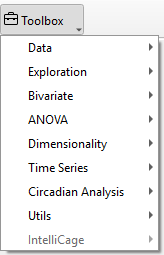
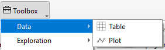
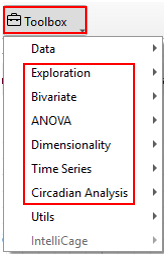
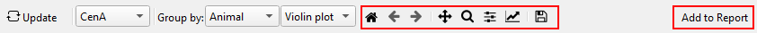
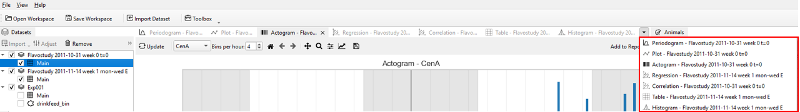
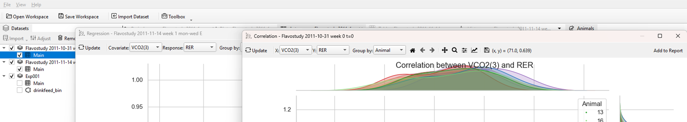

# Toolbox Widgets

The *Toolbox* Widget in TSE Analytics software is the central hub for data analysis, encompassing a comprehensive range of statistical methods. Users can seamlessly visualize and analyze their selected datasets, leveraging intuitive tools and customizable options to gain insights.




```
├── Toolbox
│   ├── Data
│   │   ├── Table
│   │   ├── Plot
│   ├── Exploration
│   │   ├── Histogram
│   │   ├── Distribution
│   │   ├── Normality
│   ├── Bivariate
│   │   ├── Correlation
│   │   ├── Regression
│   ├── ANOVA
│   │   ├── One-way ANOVA
│   │   ├── N-way ANOVA
│   │   ├── Repeated Measures ANOVA
│   │   ├── Mixed-design ANOVA
│   │   ├── ANCOVA
│   ├── Dimensionality
│   │   ├── Matrix Plot
│   │   ├── PCA
│   │   ├── t-SNE
│   ├── Time series
│   │   ├── Decomposition
│   │   ├── Autocorrelation
│   ├── Circadian Analysis
│   │   ├── Actogram
│   │   ├── Periodogram
│   ├── Utils
│   │   ├── Report
│   ├── IntelliCage

```

## Data Widget ##



The _Data Widget_ is designed to display the selected raw dataset, offering two intuitive view modes to suit user needs. The **Table** view presents data in a structured, tabular format, making it easy to reference and interpret specific values. Alternatively, the **Plot** view visualizes data through charts, providing a clear and concise way to identify patterns, trends, and distributions at a glance.

## Statistical Analysis Widgets ##

- **Statistical Tools** 



The software provides a comprehensive suite of data analysis tools. **Exploration** supports initial data examination, **Bivariate** analysis evaluates relationships between two variables (e.g., correlation and regression), and **ANOVA** compares means across multiple groups. Dimensionality reduction methods, such as PCA, simplify high-dimensional datasets. **Time Series** analysis addresses temporal data through decomposition and autocorrelation, while **Circadian Analysis**, including Actogram and Periodogram, enables the study of animals’ circadian rhythms. Researchers may select the methods most appropriate to their experimental goals and data characteristics.

- **Customize the appearance of the result** 

To further customize the appearance of the plot generated by these statistical widgets, use the **Plot Menu** located above the graph.



- **Home button** (‘House’): Reset the orientation of the plot in its frame.
- **Undo/Redo** (‘Arrows’ left/right): Undo and redo actions regarding the orientation of the graph in its frame (moving and zooming).
- **Pan** (‘Arrow cross’):  Grab and move the graph within the frame of the plot.
- **Zoom** (‘Magnifying glass’): Select an area of the plot to zoom in/ enlarge the selected area.
- **Subplots** (‘Slider bars’): Adjust the dimensions of frame borders and spacings between graphs (in the case of multiple plots).
- **Customize** (‘Graph’): Define title, axis range, label and scale, and legend. Adjust style, size and color of curves (applies only to some elements within normality plots and violin plots).
- **Save** (‘Memory disc’): Save image on the hard drive.

!!! note
    To display plots or apply any changes in the plot settings, for example, when changing variables or groups — DO NOT forget to click **Update** in the control panel.
    The graphs will not update automatically.
    However, any changes in the graph appearance made through the **Plot Menu** are applied immediately, WITHOUT the need to click **Update**.

Detailed instructions for using each statistical method are provided in subsequent chapters.


## Utils Widget ##

The _Utils_ widget is designed to help users edit and refine reports generated from data analysis. After completing the analysis, clicking **Update** for showing the analysis result, then click **Add to Report** , the report will be copied into the report editor. Users can then navigate to **Toolbox - Utils- Report** to access the editor, where can customize and format their report content to align with their presentation or documentation needs.

- **Multi-Datasets Display** 

The advanced features of the *Toolbox* include Multi-Dataset Support and Window Management, providing enhanced flexibility and efficiency for data analysis.
Users can select and analyze multiple datasets simultaneously, applying different methods to separate datasets within the same session to facilitate comparative insights. 



Additionally, individual analysis windows can be detached and repositioned, while multiple views can be displayed within a single workspace, streamlining multitasking and result comparison.


